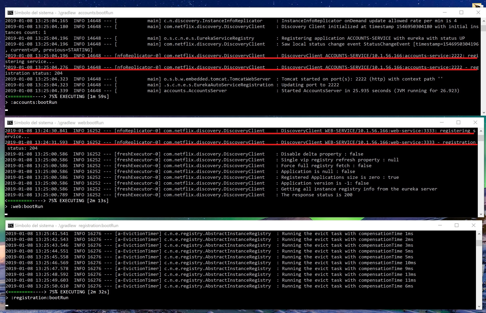
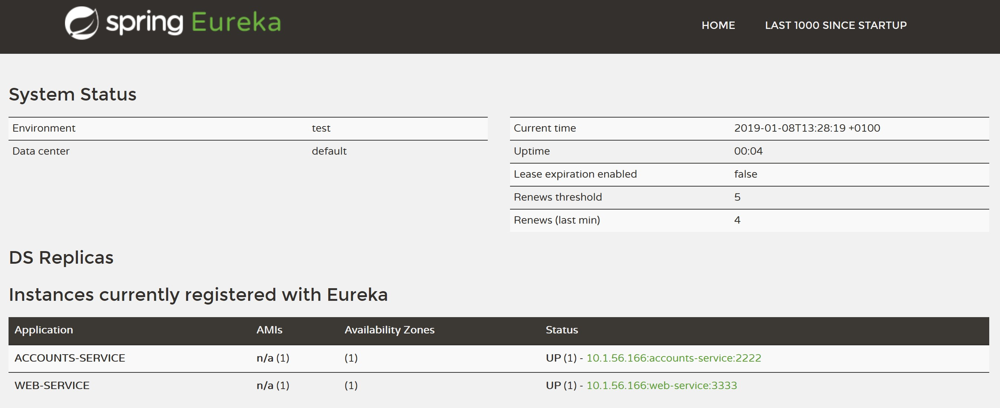
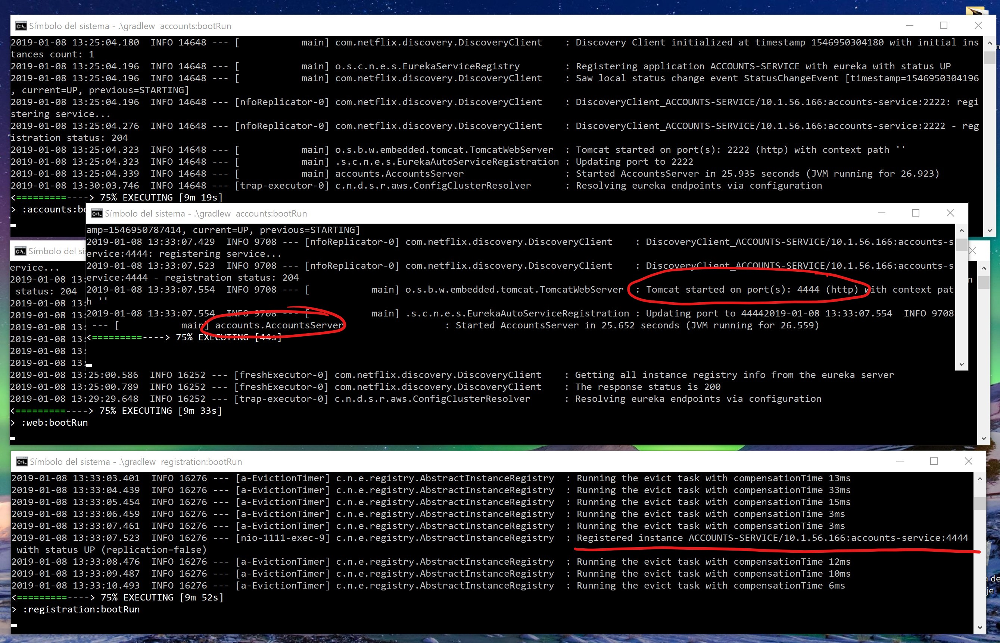

# lab-6-microservices

## Introducción
En este documento se especifican las pruebas realizadas sobre el código dado (con Eureka como Service Discovery) y sus resultados.

## Pruebas

### 1. 2 microservicios funcionando y registrados
Solo deben iniciarse ambos una vez Eureka está funcionando y los detecta automáticamente.

### 2. Los dos microservicios deben mostrarse

### 3. Se levanta un segundo Account Microservice en otro puerto y se registra
Se registra correctamente pese a ya existir uno. A partir de ahora funcionaran ambos, una vez uno y otras veces otro.

### 4. ¿Qué ocurre al matar uno de los Account Microservice?
Eureka actualiza sus registros, dejando de mostar como disponible el servicio muerto. A partir de este momento será el restante el que se encargue de dar la funcionalidad por lo que la página seguirá funcionando.

Al realizar esta prueba Eureka ha tardado en actualizarse y ha servido para comprobar como utiliza los diversos microservicios iguales registrados, pues uno estaba caído pero no lo había detectado y continuaba enviando peticiones que resultaban erroneas. Estas peticiones erroneas solo pasaban a veces, cuando se consultaba al microservicio muerto.